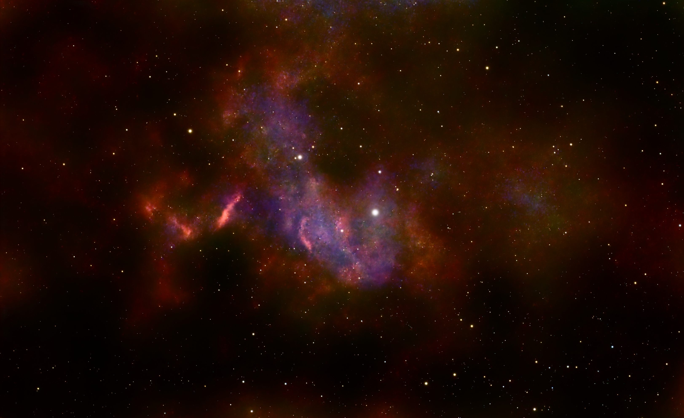

# EQHG1 Equatorial mount with harmonic gearing project
<h1>Introduction</h1>

This is my record of a DIY equatorial mount for astronomy use. It is a design based on various collated ideas from other projects and and it is designed to be built easily using readily available parts and 3D printed parts. Whilst the goal has not been to make this the cheapest project, consideration has been made in terms of 'value for money'. Please note, none of the links are affiliates, etc., they are just links to the products that I purchased myself and used on this project. It was designed to be clamped with the Vixen Dovetail standard. I only have a few clamps on hand, but they all seem to work fine.

It is set up in a modular fashion that building only one of the two motors, it can be used as a simple sky tracker. Using two will allow it to be used as a GoTo mount with dual axis tracking - each module is identical. You could even cascade 4 mounts to create an auto-PA Goto EQ mount! All 3D printed parts were printed on my Bambu P1S using Bambu Labs PETG-CF. I am sure other printer and filament combinations can be used, but you may need to test fit the parts as required. 

As built, each module weights 1.537 g, so a total weight of just over 3.0 kg.

<h1>BoM</h1>

The below is for 1 motor, you will need 2 for a full GoTo/2 axis tracking mount. You can substitute different parts or motos gear ratios to match your needs, but I will not be able to provide additional STL files, etc..

<h2>Hardware</h2>
<ul>
<li>1x ZXF14 100:1 Harmonic Gear (https://www.aliexpress.com/item/1005006514715087.html)</li>
<li>1x 50:1 Nema 17 Planetry Gear (https://www.aliexpress.com/item/1005007382016476.html)</li>
<li>1x 6810ZZ Bearing</li>
<li>1x Universal Dovetail plate ('Style Two' https://www.aliexpress.com/item/1005002630127603.html)</li>
<li>1x Yellow grease (but I used red lithium, as that is what I had on hand)</li>
<li>M3 SHCS</li>
<li>M4 SHCS</li>
<li>M8 SHCS</li>
<li>M3 Heat inserts (RutheX size 4.6 mm diameter 5.7 mm length)</li>
</ul>

<h2>3D Printed Parts</h2> 

All the of the modelling was done in Rhino 3D v8. Yes, it is not a true parametric modeller like Fusion, etc., but it is a package that I own, have been using for over 20 years and thus familiar with it. There are a total of 6 printed parts, all were prototyped in PETG-HF (https://store.bambulab.com/products/petg-hf) and final printed in PETG-CF (https://store.bambulab.com/products/petg-cf). I used the CF product because I liked the colours and finish better, does not specifically require drying before use (though I have a drying cabinet) and the mechanical properties are slightly better. Of course, feel free to use whatever you desire or have on hand.

It has been designed to be printed without any supports and also split to allow some colour creativity on your part. I had no issues printing any of the parts in my Bmabu P1S and the settings I used were basically a strong 0.20 mm.

<ol>
  <li>EQ_PG_Body_04 Main Body (to connect the NEMA17 motor)</li>
  <li>EQ_PG_Spacer_01 Sepacer Ring (to clear the ZXF14 body screw heads)</li>
  <li>EQ_HG_Spacer_01 Harmonic Gear Separator (to space the ZXF14 from the main body but maintain the dovetail rail)</li>
  <li>EQ_HG_Body_03 Harmonic Gear mounting ring (to mount the sandwhich the harmonic gear to the main body and also enclose the 6810 bearing)</li>
  <li>EQ_Output_Plate_03 Output Plate (to connect the harmonic gear to the dovetail clamp plate and also sits within the 6810 bearing)</li>
  <li>EQ_MotorConnect_03 GX12 socket mount (to connect the NEMA17 motor to the GX12 cable) This is the one part I am not happy with, it doesn't sit right, and the connection between the motor and the socket is not ideal, I would like to improve this.</li>
</ol>

<h2>Electronic</h2>

I have used a Fystec E4 as the OnStepX controller board and found that the settings that works well so far to be (for both motors):

<ul>
<li>Steps per degree: 44,444.444</li>
<li>Microsteps: 16</li>
<li>Everything as standard as per the OnStepX fresh install</li>
</ul>

For reference, I tried reducing the microsteps to 8 or lower, to increase slewing speed, but found it to slip and stall. It would appear that a minimum of 16 microsteps works well so far.

<h1>Testing</h1>

My current load is an Askar SQA55/ASI622MC with EAF and a 30mm guidescope/ASI120MM - quite a light load. Having used this with an OnStepX controller and AsiAir Lite, I have found that the tracking erros have been in the region of 1.0 RMS typically, reaching as low as 0.64 RMS. So far, I've had no issues with up to 2 minute exposures using auto-guiding. This was done from my Bortle 9 high rise balcony, with only a rough eyeball PA (I did not use the PA function as yet).

Here are some initial images taken with the mount, using the Askar SQA55 with ASI662MC camera with autoguiding on a 30mm/ASI120MM scope. Please note that I have only being doing astrophotography for a month, as I started in Nov 2024. The image was capture using this mount, processed in PixInsight with various proceses (GraXpert, BlurXT, NoiseXT and StarXT), I am <u>NOT an experienced AP</u>. I am learning and still have a <i>long, long, long</i> way to go.

<figure>
    
    <figcaption>AE Aurigae taken Dec 2024. 125x 30 second subs. There are some star trailing, direction of the trails are from the top left to bottoh right, maybe due to poor PA, but to be further reviewed and tweaked.</figcaption>
</figure>

<h1>Next Steps</h1>

More testing is required. In more conditions, under different loads, tracking times, etc. I will for sure try it with my Takahashi FC-100DC, though its fairly light, it is quite a long tube which might start to test its true performance.

Moving forward, I would like to consider if using a 27:1 PG gear as a more appropriate first stage, as that could still provide a similar steps per degree, 48,000 using 32 microsteps but also an option for lower steps at 24,000 steps using 16 microsteps. Or even using a 50:1 harmonic gear.

As the next 'evolution' of the project, I would like to consider having a 'single body' mount, where both the DEC and RA are on one body with the electronics. In this arrangement, I would try to reduce the weight and bulk and make it a portable travel GoTo EQ mount. Targeting a 2 kg limit or so and including all the components within the single body, so only need to add power. Mount connection could be done with Wi-Fi or USB.

