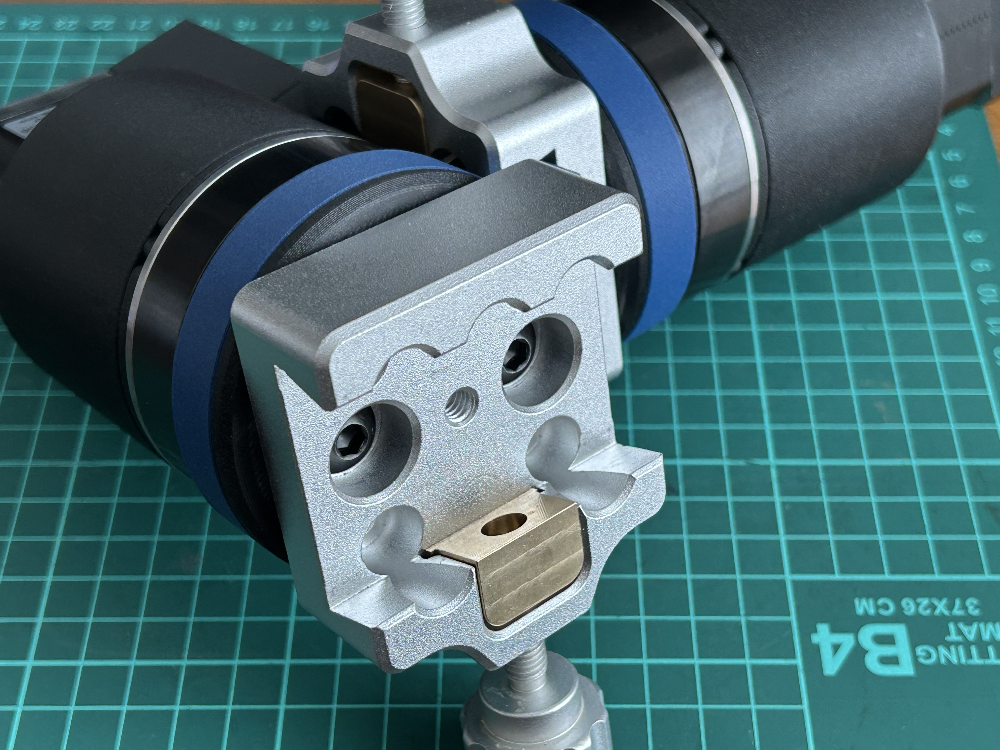
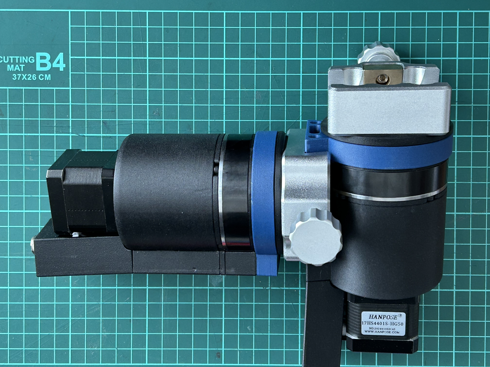
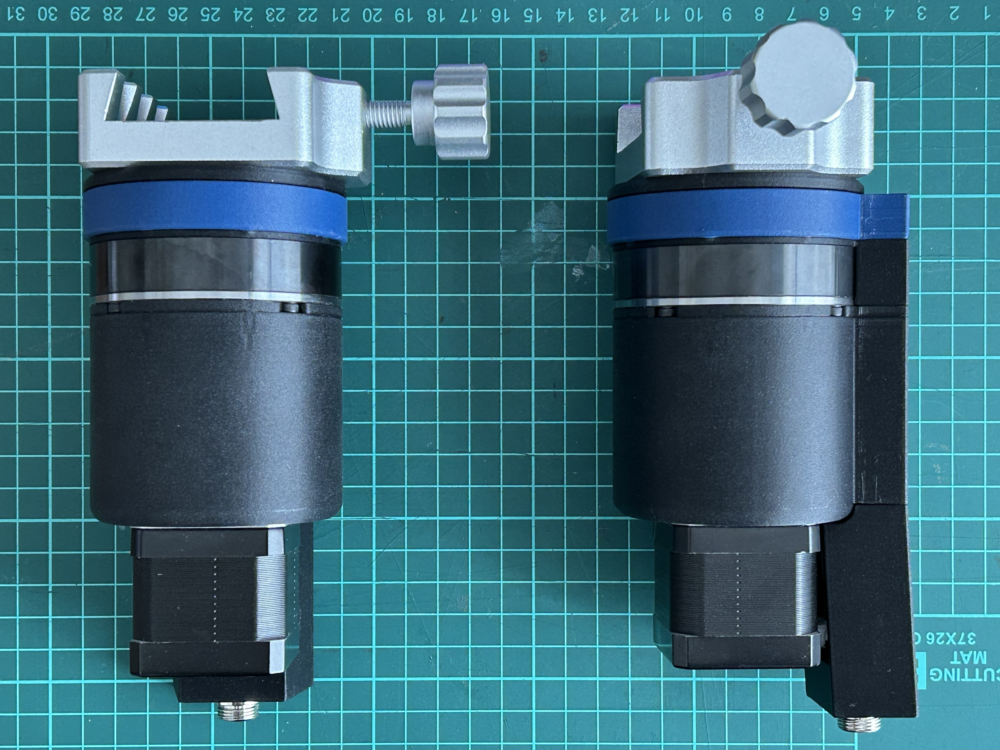
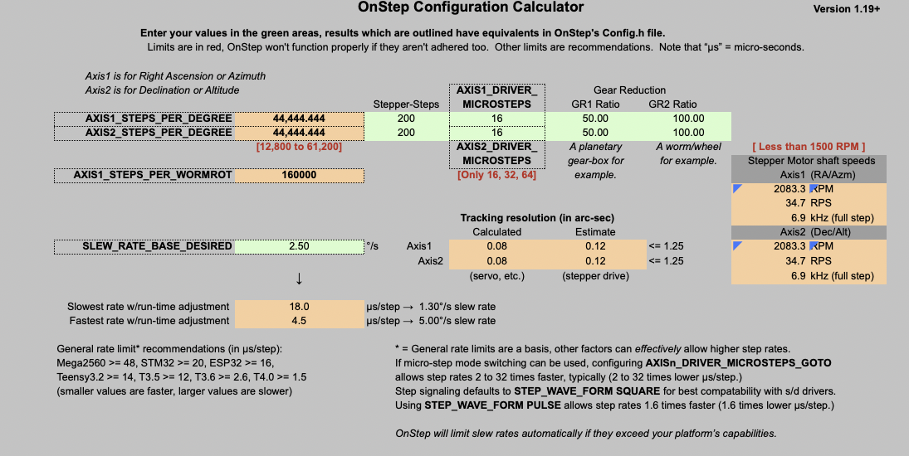
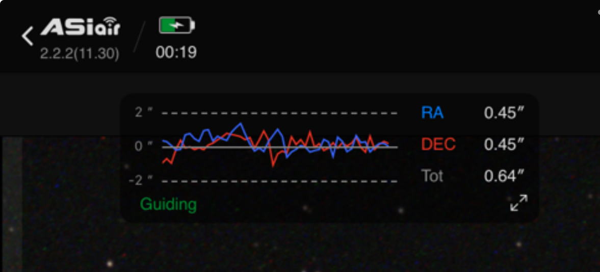
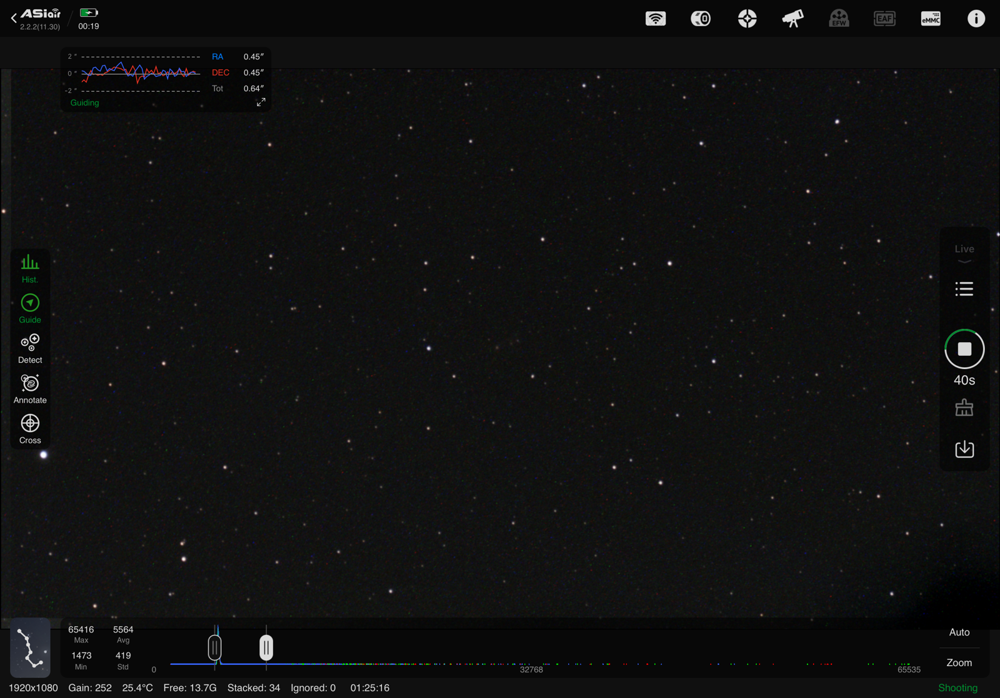

# EQHG1 Equatorial mount with harmonic gearing project
<h1>Introduction</h1>

This is my record of a DIY equatorial mount for astronomy use. It is a design based on collated ideas from other projects and and it is designed to be built easily using readaily available parts and 3D printed parts. Whilst the goal has not been to make this the cheaapest project, consideration has been made in terms of 'value for money'.

It is set up in a modular fashion that building only one of the two motors, it can be used as a simple sky tracker. Using two will allow it to be used as a GoTo mount with dual axis tracking, etc.. Each module are identical. All 3D printed parts were printed on my Bambu P1S using Bambu Labs PETG-CF. I am sure other printer and filament combinations can be used, but you may need to test fit the parts as required. 

As built, each module weights 1.537 g, so a total weight of just over 3.0 kg.

<h1>BoM</h1>

The below is for 1 motor, you will need 2 for a full GoTo/2 axis tracking mount). You can substitute different parts or motos gear ratios to suite your needs, but I will not be able to provide additional STL files, etc., to match.

<h2>Hardware</h2>
<ol>
<li>1x ZXF14 100:1 Harmonic Gear (https://www.aliexpress.com/item/1005006514715087.html)</li>
<li>1x 50:1 Nema 17 Planetry Gear (https://www.aliexpress.com/item/1005007382016476.html)</li>
<li>1x 6810ZZ Bearing</li>
<li>1x Universal Dovetail plate ('Style Two' https://www.aliexpress.com/item/1005002630127603.html)</li>
<li>1x Yellow grease (but I used red lithium, as that is what I had on hand)</li>
<li>M3</li>
<li>M4</li>
<li>M8</li>
</ol>

<h2>3D Printed Parts</h2> 

<h2>Electronic</h2>

I have used a Fystec E4 as the OnStepX controller board and found that the settings that works well so far to be (for either motors):

<ol>
<li>Steps per degree: 44,444.444</li>
<li>Microsteps: 16</li>
<li>Everything as standard as per the OnStepX fresh install</li>
</ol>

For reference, I tired reducing the microsteps to 8 or lower, to increase slewing speed, but found it to slip and stall. It would appear that a minimum of 16 microsteps works well so far.

<h1>Testing</h1>

My current load is an Askar SQA55/ASI622MC with EAF and a 30mm guidescope/ASI120mm - quite a light load. Having used this with OnStepX controller and AsiAir Lite, I have found that the tracking erros have been in the region of 1.0 RMS typically, reaching as low as 0.6 RMS.

<h1>Next Steps</h1>

More testing is required. In more conditions under different loads, tracking times, etc. I will for sure try it with my Takahashi FC-100DC, though its fairly light, is quite a long load which might start to test its true performance.

Moving forward, I would like to consider if using a 27:1 PG gear as a more appropriate first stage, as that would still give a similar steps per degree, 48,000 using 32 microsteps and also an option for lower steps at 24,000 steps using 16 microsteps. Or even using a 50:1 harmonic gear.

As the next 'evolution' of the project, I would like to consider having a 'single body' mount, where both the DEC and RA are on one body with the electroncis. In this arrange, I would try to reduce the weight and bulk and make it a very portable travel GoTo EQ mount. Making it smaller, easier to package and most importantly, lighter.

